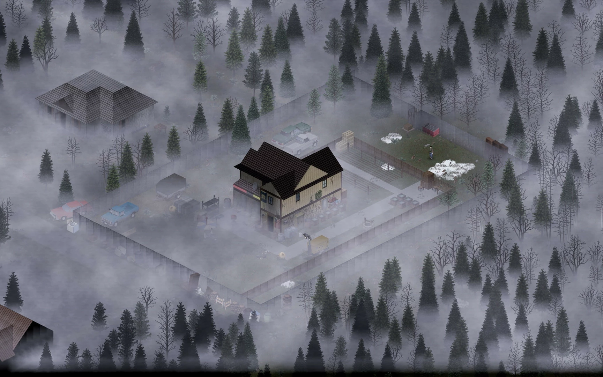

# Project Zomboid 41_78_16 in container

This container get the torrent file and downloaded the game from archive internet,
setup then you can plug and play using the container but isolated from system.

# Please support the game

https://projectzomboid.com/blog/

Project Zomboid is an open-ended zombie-infested sandbox. It asks one simple question – how will you die?

In the towns of Muldraugh and West Point, survivors must loot houses, build defences and do their utmost to delay their inevitable death day by day. No help is coming – their continued survival relies on their own cunning, luck and ability to evade a relentless horde.

# Already available features:

- Hardcore Sandbox Zombie Survival Game with a focus on realistic survival.
- Online multiplayer survival with persistent player run servers.
- Local 4 player split-screen co-op
- Hundreds of zombies with swarm mechanics and in-depth visual and hearing systems.
- Full line of sight system and real-time lighting, sound and visibility mechanics.
- Hide in the shadows, keep quiet and keep the lights off at night, or at least hang - sheets over the windows.
- Vast and growing map (loosely based on a real world location) for you to explore, loot and set up your fortress. Check out Blindcoder’s map project: http://pzmap.crash-override.net/
- Use tools and items to craft weapons, barricade and cook. You can even build zombie proof forts by chopping trees, sawing wood and scavenging supplies.
- Deal with depression, boredom, hunger, thirst and illness while trying to survive.
- Day turns to night. The electricity falters. Hordes migrate. Winter draws in. Nature gradually starts to take over.
- Farming, trapping, fishing, carpentry, cooking, trapping, character customization, skills and perks that develop based on what you do in-game.
- Proper zombies that don’t run. (Unless you tell them to in the sandbox menu).
- A ton of amazing atmospheric music tracks by the prodigy that is Zach Beever.
- Imaginative Challenge scenarios and instant action ‘Last Stand’ mode, on top of regular Sandbox and Survival.
- Full, open and powerful Lua modding support.
- Xbox Controller Gamepad support on Windows. [Others pads can be set up manually. Gamepad support not currently available on Mac] 

# Planned Features:

- The return of our PZ Stories mode that also serves as first ever tutorial actively trying to kill you at every turn. Kate and Baldspot return!
- In-depth and varied NPC encounters driven in a persistent world, powered by a metagame system that turns each play-through into your very own zombie survival movie with emergent narrative gameplay.
- Constant expansion of the countryside and cities around Muldraugh and West Point.
- Full wilderness survival systems, animals and hunting for food.
- More items, crafting recipes, weapons and gameplay systems. 

